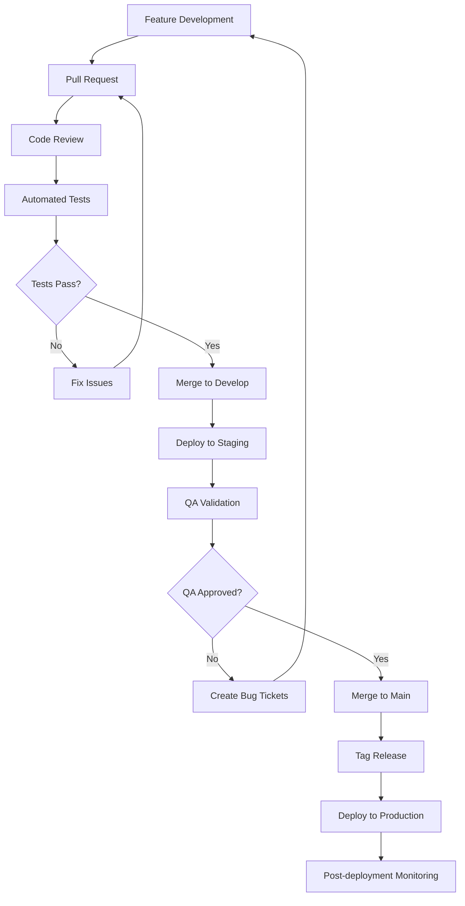
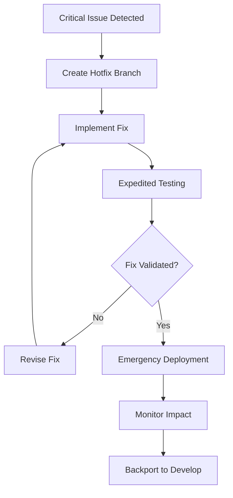

# 🚀 Release Strategy & Documentation

## **Release Management Overview**

### **Release Philosophy**
- **Continuous Delivery:** Every commit is potentially shippable
- **Feature Toggles:** New features hidden behind flags until ready
- **Staged Rollouts:** Progressive deployment across environments
- **Performance Monitoring:** Real-time metrics for every release

### **Release Types & Versioning**

#### **Semantic Versioning Strategy**
```
MAJOR.MINOR.PATCH-PRERELEASE+BUILD

Examples:
v1.0.0          # Initial production release
v1.1.0          # New accessibility features
v1.1.1          # Bug fixes and performance improvements
v1.2.0-beta.1   # Beta release with Smart TV navigation
v2.0.0          # App Router implementation
```

#### **Release Categories**
```typescript
interface ReleaseTypes {
  hotfix: {
    version: 'PATCH',
    timeline: '< 4 hours',
    approval: 'Engineering Lead',
    scope: 'Critical bug fixes only',
    testing: 'Smoke tests + affected area'
  }

  patch: {
    version: 'PATCH',
    timeline: '1-2 days',
    approval: 'Team Lead + QA',
    scope: 'Bug fixes, minor improvements',
    testing: 'Full regression suite'
  }

  minor: {
    version: 'MINOR',
    timeline: '1 week',
    approval: 'Product + Engineering + QA',
    scope: 'New features, enhancements',
    testing: 'Complete test suite + manual validation'
  }

  major: {
    version: 'MAJOR',
    timeline: '2+ weeks',
    approval: 'John + Full team sign-off',
    scope: 'Breaking changes, major features',
    testing: 'Comprehensive testing + user validation'
  }
}
```

## **Deployment Pipeline Architecture**

### **Environment Strategy**
```typescript
interface EnvironmentPipeline {
  local: {
    purpose: 'Developer machines',
    data: 'Mock data, local videos',
    features: 'All features enabled',
    monitoring: 'Development tools only'
  }

  development: {
    purpose: 'Continuous integration testing',
    url: 'https://dev-video-player.vercel.app',
    data: 'Test data, sample videos',
    features: 'Feature flags for testing',
    monitoring: 'Basic error tracking'
  }

  staging: {
    purpose: 'Pre-production validation',
    url: 'https://staging-video-player.vercel.app',
    data: 'Production-like data',
    features: 'Production feature set',
    monitoring: 'Full monitoring suite'
  }

  production: {
    purpose: 'Live demo for FOX interviews',
    url: 'https://video-player-demo.vercel.app',
    data: 'Curated demo content',
    features: 'Stable features only',
    monitoring: 'Real-time monitoring + alerting'
  }
}
```

### **CI/CD Pipeline Configuration**
```yaml
# GitHub Actions Deployment Pipeline
name: Release Pipeline

on:
  push:
    branches: [main, develop]
    tags: ['v*']
  pull_request:
    branches: [main]

jobs:
  quality-gates:
    runs-on: ubuntu-latest
    steps:
      - name: Code Quality Check
        run: |
          npm run lint
          npm run typecheck
          npm run test:unit -- --coverage

      - name: Security Scan
        uses: github/super-linter@v4
        env:
          DEFAULT_BRANCH: main
          GITHUB_TOKEN: ${{ secrets.GITHUB_TOKEN }}

      - name: Accessibility Check
        run: npm run test:a11y

  build-and-test:
    needs: quality-gates
    runs-on: ubuntu-latest
    strategy:
      matrix:
        app: [web-player-pages, web-player-app]
        node-version: [18, 20]
    steps:
      - name: Build Application
        run: npm run build --workspace=${{ matrix.app }}

      - name: Run E2E Tests
        run: npm run test:e2e --workspace=${{ matrix.app }}

      - name: Performance Audit
        run: npm run lighthouse --workspace=${{ matrix.app }}

  deploy-staging:
    if: github.ref == 'refs/heads/develop'
    needs: build-and-test
    runs-on: ubuntu-latest
    steps:
      - name: Deploy to Staging
        uses: vercel/action@v1
        with:
          vercel-token: ${{ secrets.VERCEL_TOKEN }}
          vercel-org-id: ${{ secrets.ORG_ID }}
          vercel-project-id: ${{ secrets.PROJECT_ID }}
          working-directory: ./apps/web-player-pages

      - name: Smoke Tests
        run: npm run test:smoke -- --baseUrl=${{ env.STAGING_URL }}

  deploy-production:
    if: startsWith(github.ref, 'refs/tags/v')
    needs: build-and-test
    runs-on: ubuntu-latest
    steps:
      - name: Production Deployment
        uses: vercel/action@v1
        with:
          vercel-token: ${{ secrets.VERCEL_TOKEN }}
          vercel-args: '--prod'

      - name: Post-deployment Validation
        run: |
          npm run test:smoke -- --baseUrl=${{ env.PRODUCTION_URL }}
          npm run lighthouse:production
          npm run test:a11y:production

      - name: Create GitHub Release
        uses: actions/create-release@v1
        env:
          GITHUB_TOKEN: ${{ secrets.GITHUB_TOKEN }}
        with:
          tag_name: ${{ github.ref }}
          release_name: Release ${{ github.ref }}
          body_path: CHANGELOG.md
```

## **Release Process Workflows**

### **Feature Release Process**


### **Hotfix Release Process**


## **Quality Gates & Deployment Criteria**

### **Automated Quality Gates**
```typescript
interface QualityGates {
  codeQuality: {
    linting: 'ESLint score: 0 errors, < 10 warnings',
    typecheck: 'TypeScript compilation: 0 errors',
    coverage: 'Test coverage: > 80% overall, > 90% critical paths',
    duplicateCode: 'Code duplication: < 5%'
  }

  security: {
    vulnerabilities: 'npm audit: 0 high/critical vulnerabilities',
    secrets: 'No secrets in code: truffleHog scan',
    dependencies: 'Dependency check: All dependencies up to date'
  }

  performance: {
    lighthouse: 'Lighthouse score: > 95 performance',
    bundleSize: 'Bundle size: < 500KB initial load',
    loadTime: 'Page load: < 3s on 3G connection',
    coreWebVitals: 'LCP < 2.5s, FID < 100ms, CLS < 0.1'
  }

  accessibility: {
    automated: 'axe-core violations: 0',
    compliance: 'WCAG 2.1 AA: 100% compliance',
    colorContrast: 'Color contrast: 4.5:1 minimum',
    keyboardNavigation: 'All features keyboard accessible'
  }

  functionality: {
    unitTests: 'Unit tests: 100% passing',
    integrationTests: 'Integration tests: 100% passing',
    e2eTests: 'E2E tests: > 95% passing (allow flaky tolerance)',
    crossBrowser: 'Browser compatibility: Chrome, Safari, Firefox, Edge'
  }
}
```

### **Manual Quality Criteria**
```typescript
interface ManualQualityCriteria {
  userExperience: [
    'Video loads and plays within 1 second',
    'All controls respond immediately to user input',
    'Navigation flows are intuitive and logical',
    'Error messages are helpful and actionable',
    'Settings persist across sessions'
  ]

  accessibility: [
    'Screen reader can access all functionality',
    'Keyboard navigation covers all interactive elements',
    'Focus indicators are clearly visible',
    'Caption customization works correctly',
    'High contrast mode is supported'
  ]

  smartTV: [
    'Remote control navigation is smooth',
    'Performance is acceptable on TV hardware',
    'UI elements are appropriately sized for TV',
    'Focus management works with D-pad',
    'Memory usage stays within TV limits'
  ]

  crossPlatform: [
    'Consistent experience across all browsers',
    'Mobile touch interactions work properly',
    'Responsive design adapts correctly',
    'Feature parity maintained where possible',
    'Platform-specific optimizations active'
  ]
}
```

## **Monitoring & Rollback Strategy**

### **Production Monitoring**
```typescript
interface ProductionMonitoring {
  realTimeMetrics: {
    errorRate: 'Alert if > 1% error rate',
    responseTime: 'Alert if average response > 2s',
    availability: 'Alert if uptime < 99.9%',
    performance: 'Alert if Lighthouse score drops > 10 points'
  }

  userExperience: {
    videoPlaybackSuccess: 'Alert if < 95% video start success',
    loadTime: 'Alert if 95th percentile > 5s',
    bounceRate: 'Monitor for > 50% bounce rate',
    userFeedback: 'Monitor GitHub issues and feedback'
  }

  businessMetrics: {
    portfolioTraffic: 'Track referrals to jdilig.me',
    demoEngagement: 'Track time spent on demo pages',
    featureUsage: 'Track which features are used most',
    conversionRate: 'Track demo to interview conversion'
  }

  technicalHealth: {
    memoryUsage: 'Monitor for memory leaks',
    errorTypes: 'Categorize and track error patterns',
    browserCompat: 'Track issues by browser/version',
    devicePerformance: 'Monitor performance by device type'
  }
}
```

### **Rollback Procedures**
```typescript
interface RollbackStrategy {
  automaticRollback: {
    triggers: [
      'Error rate > 5% for > 2 minutes',
      'Response time > 10s for > 1 minute',
      'Availability < 95% for > 5 minutes'
    ],
    action: 'Automatic revert to previous stable version',
    notification: 'Immediate Slack alert to team'
  }

  manualRollback: {
    decision: 'Team lead or on-call engineer',
    procedure: [
      '1. Assess impact and scope of issue',
      '2. Determine if hotfix or rollback is appropriate',
      '3. Execute rollback via Vercel dashboard',
      '4. Verify rollback success with smoke tests',
      '5. Communicate status to stakeholders'
    ],
    timeline: '< 15 minutes for rollback execution'
  }

  postRollback: {
    actions: [
      'Root cause analysis within 24 hours',
      'Create post-mortem document',
      'Identify preventive measures',
      'Update deployment procedures if needed',
      'Schedule team retrospective'
    ]
  }
}
```

## **Release Communication Strategy**

### **Stakeholder Communication Matrix**
```typescript
interface CommunicationStrategy {
  internal: {
    team: {
      channel: 'Slack #video-player-dev',
      frequency: 'Every deployment',
      content: 'Technical details, metrics, issues'
    },
    john: {
      channel: 'Direct communication',
      frequency: 'Major releases + issues',
      content: 'Business impact, user feedback, career relevance'
    }
  }

  external: {
    githubUsers: {
      channel: 'GitHub Releases',
      frequency: 'Tagged releases',
      content: 'Feature changes, bug fixes, breaking changes'
    },
    portfolioVisitors: {
      channel: 'jdilig.me project page',
      frequency: 'Major updates',
      content: 'New features, demo improvements, achievement highlights'
    },
    employers: {
      channel: 'LinkedIn, portfolio updates',
      frequency: 'Milestone releases',
      content: 'Professional achievements, technical innovations'
    }
  }
}
```

### **Release Notes Template**
```markdown
# Release v1.2.0 - Smart TV Navigation Enhancement

## 🚀 **New Features**
- Enhanced D-pad navigation for Smart TV platforms
- Improved focus management with visual indicators
- Performance optimizations for TV hardware

## 🐛 **Bug Fixes**
- Fixed caption positioning on mobile devices
- Resolved memory leak during video transitions
- Corrected keyboard navigation on Firefox

## 📈 **Performance Improvements**
- 15% faster initial load time
- Reduced memory usage by 20MB
- Improved HLS stream switching speed

## ♿ **Accessibility Updates**
- Enhanced screen reader announcements
- Better color contrast for focus indicators
- Improved keyboard navigation flow

## 🔧 **Technical Changes**
- Updated to React 18.2.0
- Migrated to Redux Toolkit 2.0
- Improved TypeScript strict mode compliance

## 📊 **Metrics**
- Lighthouse Score: 98/100
- WCAG Compliance: AA (100%)
- Cross-browser Support: 100%

## 🎯 **FOX Corporation Relevance**
This release directly demonstrates Smart TV platform expertise and performance optimization capabilities essential for FOX's streaming applications.

---
**Full Changelog:** [v1.1.0...v1.2.0](https://github.com/balbonits/video-player-demo/compare/v1.1.0...v1.2.0)
```

## **Feature Flag Management**

### **Feature Toggle Strategy**
```typescript
interface FeatureFlagConfig {
  flags: {
    smartTVNavigation: {
      enabled: true,
      rollout: '100%',
      description: 'D-pad navigation for Smart TV platforms'
    },
    liveTranscription: {
      enabled: false,
      rollout: '0%',
      description: 'Web Speech API transcription (browser compatibility issues)'
    },
    appRouterDemo: {
      enabled: true,
      rollout: '50%',
      description: 'Next.js App Router implementation showcase'
    },
    performanceMonitoring: {
      enabled: true,
      rollout: '100%',
      description: 'Real-time performance metrics collection'
    }
  },

  environments: {
    development: 'All flags available for testing',
    staging: 'Production flag configuration',
    production: 'Only stable flags enabled'
  }
}
```

## **Success Metrics & KPIs**

### **Release Success Criteria**
```typescript
interface ReleaseSuccessMetrics {
  technical: {
    deploymentSuccess: '100% successful deployments',
    rollbackRate: '< 5% of releases require rollback',
    hotfixFrequency: '< 1 hotfix per 10 releases',
    deploymentTime: '< 10 minutes average deployment time'
  }

  quality: {
    bugEscapeRate: '< 2% of bugs reach production',
    userReportedIssues: '< 1 issue per 1000 users',
    performanceRegression: '0 performance regressions',
    accessibilityRegression: '0 accessibility regressions'
  }

  business: {
    userSatisfaction: '> 4.5/5 user satisfaction score',
    demoEffectiveness: '> 80% positive feedback from employers',
    portfolioImpact: '> 30% increase in portfolio traffic',
    careerProgression: 'Interview opportunities from demo'
  }
}
```

---

**Release Management Philosophy:** Every release should move us closer to the ultimate goal of securing the FOX Corporation position while maintaining the highest standards of quality, performance, and accessibility. Each deployment is an opportunity to demonstrate professional release management practices that enterprise employers value.

This comprehensive release strategy ensures reliable, high-quality deployments that support John's career objectives while showcasing enterprise-level DevOps and release management capabilities.