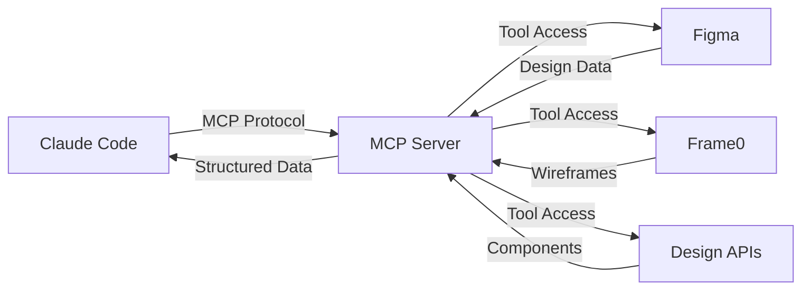
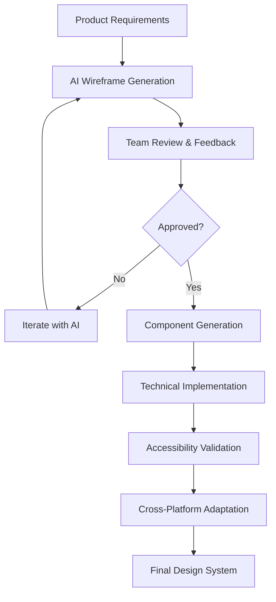

# 🎨 UX Design Workflow & AI Tools Integration

**Designer:** Riley (UX)
**Collaboration:** Morgan (coordination), Jordan (user flows), Alex (technical feasibility)
**Created:** 2024-09-18

---

## **MCP Servers & AI Design Tools Education**

### **What are MCP Servers?**
**Model Context Protocol (MCP)** is a standardized way for AI assistants like Claude Code to connect to external tools and data sources. Think of it as "USB-C for AI" - a universal connector.

#### **How MCP Works:**


#### **Benefits for Our Project:**
- **Automated Wireframing:** Generate wireframes from text descriptions
- **Design-to-Code:** Convert Figma designs directly to React components
- **Consistency:** Maintain design system consistency across platforms
- **Speed:** Accelerate UX workflow from concept to implementation

---

## **Recommended AI Design Tools for Our Video Player**

### **Option 1: Frame0 Diagramming MCP Server** ⭐ **RECOMMENDED**
```bash
# Setup (Free CLI access)
claude mcp add frame0-diagramming
```

**Why Frame0 is Perfect for Our Project:**
- ✅ **Free CLI access** through MCP
- ✅ **Natural language wireframing:** "Create video player with controls"
- ✅ **Component-based:** Perfect for our component architecture
- ✅ **Export capabilities:** Can generate structured wireframes
- ✅ **Video player specific:** Good for media interface design

**Example Commands:**
```
"Create a video player wireframe with play button, progress bar, volume control, and settings menu"
"Add Smart TV navigation indicators to the video player wireframe"
"Generate mobile version of the video player with touch-optimized controls"
```

### **Option 2: Figma MCP Server** 💎 **PREMIUM OPTION**
```bash
# Setup (Requires Figma Pro)
claude mcp add figma-dev-mode-mcp-server http://127.0.0.1:3845/mcp
```

**Figma MCP Benefits:**
- ✅ **Professional design tools** with component libraries
- ✅ **Design-to-code conversion** directly in Claude Code
- ✅ **Team collaboration** for design review
- ✅ **Design system export** for consistent implementation

**Limitation:** Requires Figma Pro subscription

### **Option 3: Superdesign MCP Server** 🚀 **ADVANCED OPTION**
```bash
# Setup (Free, no API keys required)
claude mcp add superdesign-mcp-server
```

**Superdesign Benefits:**
- ✅ **Completely free** with no API key requirements
- ✅ **AI design orchestrator** for comprehensive design workflows
- ✅ **Component generation** with props and styling
- ✅ **Logo and icon creation** for branding elements

---

## **UX Design Implementation Plan**

### **Phase 1: Wireframe Generation (Day 1)**
**Using Frame0 MCP Server**

#### **Step 1: Install and Configure Frame0**
```bash
# Install Frame0 MCP server
claude mcp add frame0-diagramming

# Test connection
claude mcp list
```

#### **Step 2: Generate Core Wireframes**
```typescript
// Wireframe generation commands
const wireframePrompts = [
  // Desktop video player
  "Create a desktop video player wireframe with these elements: 16:9 video area, centered play button overlay, bottom control bar with play/pause, progress bar, volume control, settings menu, and fullscreen button. Include accessibility labels.",

  // Mobile video player
  "Generate a mobile video player wireframe optimized for touch: portrait layout, large touch targets (56px minimum), swipe gestures for seek, tap-to-show controls, bottom sheet for settings.",

  // Smart TV interface
  "Design a Smart TV video player wireframe: large 1920x1080 layout, D-pad navigation indicators, focused element highlighting, TV-safe margins (48px), large text (18px+), spatial navigation flow.",

  // Settings panel
  "Create a settings panel wireframe for video player: caption customization (font, color, position), quality selection, accessibility options, theme toggle, organized in logical groups.",

  // Accessibility overlay
  "Generate accessibility features wireframe: high contrast mode toggle, focus indicators, screen reader announcements, keyboard navigation help, caption styling preview."
]
```

#### **Step 3: Validate Wireframes with Team**
- **Jordan (Product):** Verify wireframes match user requirements
- **Alex (Engineer):** Confirm technical feasibility of design elements
- **Sam (QA):** Review accessibility considerations in wireframes
- **Morgan (Team Lead):** Coordinate feedback and approve final designs

### **Phase 2: Component Design (Days 2-3)**
**Using Superdesign MCP for Component Creation**

#### **Component Generation Strategy:**
```typescript
// Component design prompts for Superdesign
const componentPrompts = [
  // Video player controls
  "Generate React TypeScript components for video player controls: PlayButton with accessibility props, ProgressBar with seek functionality, VolumeControl with slider and mute toggle, SettingsButton with dropdown menu.",

  // Smart TV navigation
  "Create Smart TV optimized components: large buttons (64px), clear focus indicators, D-pad navigation support, spatial layout with logical tab order.",

  // Accessibility components
  "Design accessibility-first components: ARIA-compliant labels, screen reader announcements, high contrast support, keyboard navigation helpers."
]
```

### **Phase 3: Cross-Platform Adaptations (Days 4-6)**
**Platform-Specific Design Variations**

#### **Platform Adaptation Workflow:**
```typescript
interface PlatformAdaptations {
  web: {
    baseDesign: 'Desktop wireframes with responsive breakpoints',
    adaptations: 'Mobile touch targets, tablet landscape optimization',
    tools: 'Frame0 + Superdesign for responsive variations'
  },

  mobile: {
    iOS: 'Native iOS design language with SwiftUI components',
    android: 'Material Design 3 principles with Jetpack Compose',
    tools: 'Platform-specific wireframes using AI generation'
  },

  smartTV: {
    roku: 'Roku design guidelines with BrightScript components',
    tizen: 'Samsung Tizen UI patterns with TV-safe areas',
    vizio: 'Vizio SmartCast interface guidelines',
    tools: 'TV-specific wireframes with Focus indicators'
  }
}
```

---

## **AI-Assisted Design Workflow**

### **Integrated Design Process**


### **Quality Control for AI-Generated Designs**
```typescript
interface DesignQualityControl {
  technical_validation: {
    owner: 'Alex (Engineer)',
    criteria: [
      'Components are technically feasible',
      'Design supports performance requirements',
      'Responsive behavior is clearly defined',
      'Integration points are well-specified'
    ]
  },

  accessibility_validation: {
    owner: 'Sam (QA) + Riley (UX)',
    criteria: [
      'WCAG 2.1 AA compliance built into design',
      'Focus indicators are clearly specified',
      'Touch targets meet minimum size requirements',
      'Color contrast ratios meet standards'
    ]
  },

  user_experience_validation: {
    owner: 'Riley (UX) + Jordan (Product)',
    criteria: [
      'User flows are logical and intuitive',
      'Design supports all user stories',
      'Cross-platform consistency maintained',
      'Smart TV considerations integrated'
    ]
  }
}
```

---

## **Implementation Timeline for UX Workflow**

### **Day 1: Tool Setup & Core Wireframes**
- **Morning (2 hours):** Install and configure Frame0 MCP server
- **Afternoon (4 hours):** Generate core wireframes for all platforms
- **Evening (2 hours):** Team review and iteration

### **Day 2: Component Design**
- **Morning (3 hours):** Use Superdesign to generate component specifications
- **Afternoon (3 hours):** Cross-platform component adaptations
- **Evening (2 hours):** Accessibility review and enhancements

### **Day 3: Design System Creation**
- **Morning (2 hours):** Create comprehensive design system documentation
- **Afternoon (4 hours):** Generate design tokens and CSS variables
- **Evening (2 hours):** Final design review and approval

### **Days 4-6: Implementation Support**
- **Ongoing:** Support Alex with design-to-code conversion
- **Validation:** Ensure implemented designs match wireframes
- **Iteration:** Refine designs based on technical constraints

---

## **Expected Outcomes**

### **Design Deliverables**
- [ ] **Complete wireframe set** for all platforms and screen sizes
- [ ] **Component library specification** with accessibility built-in
- [ ] **Design system documentation** with tokens and variables
- [ ] **Cross-platform adaptation guide** for consistent experience
- [ ] **Accessibility compliance documentation** for all design elements

### **Learning Outcomes for John**
- **MCP Understanding:** How to integrate AI tools into development workflow
- **Modern UX Patterns:** Smart TV navigation, accessibility-first design
- **Design Systems:** How to create scalable, consistent design systems
- **AI-Assisted Design:** Leveraging AI for faster design iteration

### **Professional Demonstration**
- **Enterprise Design Process:** Professional UX workflow and documentation
- **AI Integration:** Modern AI-assisted design capabilities
- **Accessibility Leadership:** WCAG 2.1 AA compliance throughout design
- **Cross-Platform Expertise:** Consistent experience across 6 platforms

**Riley (UX):** *"This AI-assisted workflow will let us create professional-quality wireframes and components much faster than traditional design tools, while ensuring accessibility is built in from the start. Perfect for our tight timeline!"*

**Ready to set up Frame0 MCP server for our wireframing workflow?**