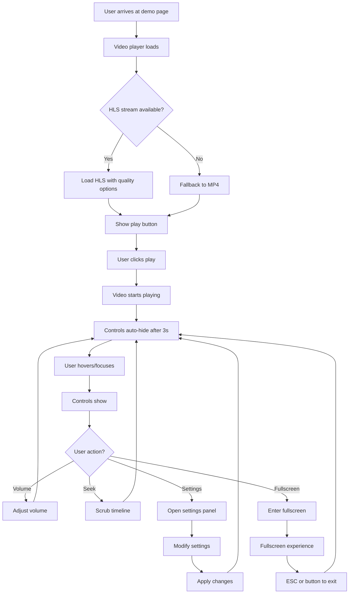
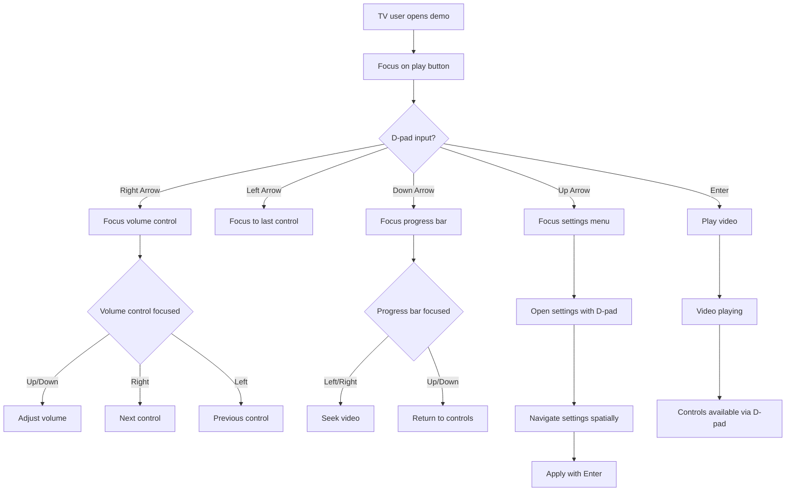
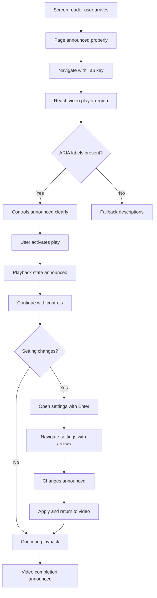

# 🎨 Video Player Wireframes & User Flows

**Designer:** Riley (UX)
**Created:** 2024-09-18
**Last Updated:** 2024-09-18
**Collaboration:** Jordan (Product) for user flows and requirements

---

## **Design Philosophy & Approach**

### **Accessibility-First Design Principles**
- **Keyboard Navigation:** Every interactive element reachable via Tab/arrow keys
- **Screen Reader Support:** Proper ARIA labels and semantic markup
- **High Contrast:** 4.5:1 minimum color contrast ratio
- **Touch Targets:** 44px minimum for mobile, 64px for Smart TV
- **Focus Indicators:** 3px minimum outline width, clearly visible

### **Cross-Platform Considerations**
- **Desktop:** Mouse + keyboard interaction, standard web patterns
- **Mobile:** Touch-first design, larger targets, thumb-friendly zones
- **Smart TV:** D-pad navigation, larger UI elements, couch viewing distance
- **Accessibility:** Screen reader optimized, keyboard-only operation

---

## **Core Video Player Interface**

### **Desktop/Web Player Layout**
```
┌─────────────────────────────────────────────────────────────┐
│ 🎬 FOX Video Player Demo                    [🌙] [⚙️] [?] │ ← Header
├─────────────────────────────────────────────────────────────┤
│                                                             │
│  ┌─────────────────────────────────────────────────────┐   │
│  │                                                     │   │
│  │                 VIDEO CONTENT                       │   │ ← 16:9 Aspect
│  │                                                     │   │   Ratio
│  │                [▶️ PLAY BUTTON]                     │   │
│  │                                                     │   │
│  │  [CC] Captions Available          [HD] 1080p       │   │ ← Overlays
│  └─────────────────────────────────────────────────────┘   │
│                                                             │
│  ┌─ Video Controls ──────────────────────────────────┐     │
│  │ [▶️] [⏸️] [🔇] [▮▮▮▮▮░░░] [⚙️] [📺] [⛶]      │     │ ← Control Bar
│  │  1    2    3       4        5    6    7           │     │   Tab Order
│  └────────────────────────────────────────────────────┘     │
│                                                             │
│  Progress: ████████████░░░░░░░░░ 12:34 / 25:46             │ ← Progress Info
│  Quality: Auto (1080p) • Buffered: 15s ahead               │
│                                                             │
│  ┌─ Demo Information ─────────────────────────────────┐     │
│  │ 🎯 This demo showcases:                            │     │
│  │ • HLS adaptive streaming with quality selection    │     │ ← Educational
│  │ • Smart TV-optimized keyboard navigation          │     │   Context
│  │ • WCAG 2.1 AA accessibility compliance           │     │
│  │ • Cross-platform performance optimization         │     │
│  └────────────────────────────────────────────────────┘     │
└─────────────────────────────────────────────────────────────┘

Interaction Annotations:
1. Play/Pause Toggle (Spacebar, Enter)
2. Volume Control (Up/Down arrows when focused)
3. Progress Bar (Click to seek, Left/Right arrows for scrub)
4. Settings Menu (Enter to open, Escape to close)
5. Picture-in-Picture (Enter to toggle)
6. Fullscreen Toggle (F key, Enter when focused)
```

### **Mobile Interface (Portrait)**
```
┌─────────────────────────┐
│ ●●● 🔋100% 📶 ⏰12:34  │ ← Status Bar
├─────────────────────────┤
│ ← Video Demo      [⚙️] │ ← App Header
├─────────────────────────┤
│                         │
│ ┌─────────────────────┐ │
│ │                     │ │
│ │   VIDEO CONTENT     │ │ ← Video Container
│ │                     │ │   (Landscape crop)
│ │    [LARGE PLAY]     │ │
│ │                     │ │
│ │  [CC] Available     │ │ ← Video Overlays
│ └─────────────────────┘ │
│                         │
│ ┌─ Touch Controls ───┐  │
│ │ [▶️] [🔊] [⛶]     │  │ ← Large Touch
│ │  56px 56px 56px    │  │   Targets
│ └─────────────────────┘  │
│                         │
│ ┌─ Progress ─────────┐  │
│ │ ████████░░░░░░░     │  │ ← Progress Bar
│ │ 12:34 / 25:46      │  │   (Larger for touch)
│ └─────────────────────┘  │
│                         │
│ Quality: Auto (720p)    │ ← Status Info
│ Tap screen for controls │
│                         │
│ ┌─ Accessibility ────┐  │
│ │ [🔤] Caption Style │  │ ← Quick Access
│ │ [🎧] Audio Description │  │   A11y Features
│ └─────────────────────┘  │
└─────────────────────────┘

Touch Gestures:
- Single tap: Play/pause toggle
- Double tap: Fullscreen toggle
- Swipe left/right: Seek 10s backward/forward
- Pinch: Zoom (if supported)
- Two-finger tap: Show/hide controls
```

### **Smart TV Interface (10-foot Experience)**
```
┌─────────────────────────────────────────────────────────────┐
│                    🔵 FOCUSED ELEMENT                       │ ← Focus Indicator
├─────────────────────────────────────────────────────────────┤
│                                                             │
│  ┌─────────────────────────────────────────────────────┐   │
│  │                                                     │   │
│  │                 VIDEO CONTENT                       │   │ ← Large Video
│  │                                                     │   │   (TV Optimized)
│  │            [🔵 PLAY BUTTON]                         │   │
│  │              ▲ FOCUSED                              │   │
│  │         Use ENTER to play                           │   │ ← Instruction Text
│  └─────────────────────────────────────────────────────┘   │
│                                                             │
│  ┌─ TV Remote Controls ─────────────────────────────────┐   │
│  │ [▶️] [⏸️] [🔇] [🔵▮▮▮▮░░░] [⚙️] [📺]           │   │ ← TV Controls
│  │   1     2    3        4         5    6              │   │   (Larger)
│  │   🔵    ○    ○        ○         ○    ○              │   │
│  │        ← D-pad navigation →                          │   │
│  └──────────────────────────────────────────────────────┘   │
│                                                             │
│  Instructions: ↑↓←→ Navigate • ⏎ Select • Menu Settings    │ ← Help Text
│                                                             │
│  ┌─ TV Safe Area ──────────────────────────────────────┐   │
│  │ Progress: ██████████░░░░░░ 12:34 / 25:46           │   │ ← Large Text
│  │ Quality: Auto (1080p) • Network: Excellent          │   │   (48px margins)
│  └──────────────────────────────────────────────────────┘   │
└─────────────────────────────────────────────────────────────┘

D-pad Navigation Pattern:
- UP: Video area ↔ Menu/Settings
- DOWN: Video area ↔ Progress bar
- LEFT/RIGHT: Between controls (logical spatial order)
- ENTER: Activate focused control
- BACK/ESC: Previous menu level
```

---

## **Settings Panel Interface**

### **Desktop Settings Panel**
```
┌─ Player Settings ─────────────────────────────────────────┐
│                                                   [✕] Close │
├───────────────────────────────────────────────────────────┤
│                                                           │
│ ┌─ Playback ─────────────────────────────────────────┐   │
│ │ Speed:        [0.5x] [0.75x] [🔵1x] [1.25x] [1.5x] │   │ ← Speed Control
│ │ Quality:      [🔵Auto] [1080p] [720p] [480p]       │   │ ← Quality Select
│ │ Audio:        [🔵English] [Spanish] [French]        │   │ ← Audio Track
│ └─────────────────────────────────────────────────────┘   │
│                                                           │
│ ┌─ Captions ────────────────────────────────────────┐    │
│ │ Enable:       [🔵On] [Off]                        │    │ ← Caption Toggle
│ │ Language:     [🔵English] [Spanish] [Off]         │    │ ← Caption Language
│ │ Size:         [Small] [🔵Medium] [Large] [XL]     │    │ ← Font Size
│ │ Color:        [🔵White] [Yellow] [Cyan] [Green]   │    │ ← Text Color
│ │ Background:   [🔵None] [Black] [Semi] [Full]      │    │ ← Background
│ │ Position:     [🔵Bottom] [Top] [Center]           │    │ ← Position
│ │                                                   │    │
│ │ Preview: "Sample caption text"                    │    │ ← Live Preview
│ │          with current settings                    │    │
│ └─────────────────────────────────────────────────────┘    │
│                                                           │
│ ┌─ Accessibility ───────────────────────────────────┐     │
│ │ High Contrast:    [🔵Off] [On]                    │     │ ← A11y Options
│ │ Reduced Motion:   [🔵Off] [On]                    │     │
│ │ Screen Reader:    [🔵Auto] [Force On] [Off]       │     │
│ │ Keyboard Nav:     [🔵Enhanced] [Standard]         │     │
│ └─────────────────────────────────────────────────────┘     │
│                                                           │
│ ┌─ Advanced ────────────────────────────────────────┐      │
│ │ Analytics:        [🔵Anonymous] [Off]             │      │ ← Privacy
│ │ Debug Mode:       [🔵Off] [On]                    │      │ ← Development
│ │ Performance:      [🔵Auto] [Power Save] [Quality] │      │ ← Performance
│ └─────────────────────────────────────────────────────┘      │
│                                                           │
│                          [Reset] [Apply] [Save]           │ ← Action Buttons
└───────────────────────────────────────────────────────────┘

Settings Navigation (Keyboard):
- Tab: Move between setting groups
- Arrow keys: Navigate within group
- Space/Enter: Toggle or select option
- Escape: Close panel without saving
```

### **Mobile Settings Panel (Bottom Sheet)**
```
┌─────────────────────────┐
│ ●●● 🔋95% 📶 ⏰12:34   │
├─────────────────────────┤
│ [Video continues above] │ ← Video stays visible
│ ▒▒▒▒▒▒▒▒▒▒▒▒▒▒▒▒▒▒▒▒▒▒▒▒▒ ← Overlay
├─ Settings ──────── [✕] ┤
│                         │
│ ┌─ Quick Settings ────┐ │
│ │ 🎵 Audio: English   │ │ ← Large Touch
│ │ 🎞️ Quality: Auto    │ │   Targets
│ │ 📝 Captions: On     │ │   (56px min)
│ │ ⚡ Speed: 1x        │ │
│ └─────────────────────┘ │
│                         │
│ ┌─ Caption Style ─────┐ │
│ │ Size: [S] [🔵M] [L] │ │ ← Quick Toggles
│ │ Color: ⚪ 🟡 🔵 🟢  │ │
│ │ "Sample text"       │ │ ← Preview
│ └─────────────────────┘ │
│                         │
│ ┌─ Accessibility ─────┐ │
│ │ [🔵] High Contrast  │ │ ← Toggle Switches
│ │ [○] Screen Reader   │ │
│ │ [🔵] Large Buttons  │ │
│ └─────────────────────┘ │
│                         │
│      [Save Changes]     │ ← Primary Action
└─────────────────────────┘

Mobile Interactions:
- Swipe up: Open settings
- Swipe down: Close settings
- Tap outside: Close settings
- Hold setting: Show help tooltip
```

---

## **User Flow Diagrams**

### **Core Video Playback Flow**


### **Smart TV Navigation Flow**


### **Accessibility User Journey**


---

## **Responsive Breakpoint Wireframes**

### **Tablet Landscape (1024px)**
```
┌─────────────────────────────────────────────────────┐
│ Video Player Demo                         [Menu] │
├─────────────────────────────────────────────────────┤
│                                                 │
│ ┌─────────────────────────────────────────────┐ │ ← Larger video
│ │            VIDEO CONTENT                    │ │   maintains
│ │                                             │ │   16:9 ratio
│ │           [PLAY BUTTON]                     │ │
│ └─────────────────────────────────────────────┘ │
│                                                 │
│ ┌─ Controls ──────────────────────────────────┐ │ ← Full control
│ │ [▶️] [🔊] [▮▮▮▮▮░░░] [⚙️] [📺] [⛶]      │ │   bar visible
│ └─────────────────────────────────────────────┘ │
│                                                 │
│ Progress: ████████░░░░░ 12:34 / 25:46          │
└─────────────────────────────────────────────────┘
```

### **Mobile Landscape (768px)**
```
┌─────────────────────────────────────────────────────┐
│ ← Demo                                    [⚙️] [⛶] │ ← Compact header
├─────────────────────────────────────────────────────┤
│ ┌─────────────────────────────────────────────────┐ │
│ │              VIDEO CONTENT                      │ │ ← Full width
│ │                                                 │ │   video
│ │              [PLAY BUTTON]                      │ │
│ │                                                 │ │
│ │ [▶️] [🔊] ████████░░░░ [⚙️] 12:34/25:46       │ │ ← Overlay
│ └─────────────────────────────────────────────────┘ │   controls
└─────────────────────────────────────────────────────┘
```

---

## **Accessibility Wireframes**

### **High Contrast Mode**
```
┌─────────────────────────────────────────────────────────────┐
│ Video Player Demo (High Contrast)              [⚫⚪] Toggle │ ← High contrast
├─────────────────────────────────────────────────────────────┤   indicator
│                                                             │
│  ┌─────────────────────────────────────────────────────┐   │
│  ║                                                     ║   │ ← Thick borders
│  ║                 VIDEO CONTENT                       ║   │   for definition
│  ║                                                     ║   │
│  ║              [⚫ PLAY BUTTON]                        ║   │ ← High contrast
│  ║                                                     ║   │   colors
│  └─────────────────────────────────────────────────────┘   │
│                                                             │
│  ┌─ Video Controls ──────────────────────────────────┐     │
│  ║ [⚫] [⚫] [⚫] [⚫⚫⚫⚫⚫⚪⚪⚪] [⚫] [⚫] [⚫]   ║     │ ← Clear visual
│  └────────────────────────────────────────────────────┘     │   separation
│                                                             │
│  Progress: ⚫⚫⚫⚫⚫⚫⚫⚫⚪⚪⚪⚪ 12:34 / 25:46          │ ← High contrast
│  Quality: Auto (1080p) • Status: Playing                   │   text
└─────────────────────────────────────────────────────────────┘
```

### **Focus State Indicators**
```
┌─ Focus Indicators Example ───────────────────────────────┐
│                                                          │
│ ┌─ Normal State ─────┐    ┌─ Focused State ──────────┐  │
│ │ [▶️ Play Video]    │    │ ┏━━━━━━━━━━━━━━━━━━━━━━━┓ │  │ ← 3px outline
│ └────────────────────┘    │ ┃ ▶️ Play Video        ┃ │  │   minimum
│                           │ ┗━━━━━━━━━━━━━━━━━━━━━━━┛ │  │
│ ┌─ Volume Control ───┐    └───────────────────────────┘  │
│ │ [🔊] [▮▮▮▮▮░░░]   │    ┌─ Keyboard Hint ─────────┐  │
│ └────────────────────┘    │ "Press Enter to activate" │  │ ← Helpful hints
│                           │ "Use arrows to adjust"    │  │
│                           └───────────────────────────┘  │
└──────────────────────────────────────────────────────────┘
```

---

## **Platform-Specific Adaptations**

### **iOS Native Interface**
```
┌─────────────────────────┐
│ ●●● 🔋100% 📶 ⏰12:34  │ ← iOS Status Bar
├─────────────────────────┤
│ ← Video Demo       Share │ ← iOS Navigation
├─────────────────────────┤
│                         │
│ ┌─────────────────────┐ │
│ │                     │ │
│ │   VIDEO CONTENT     │ │ ← Native video
│ │                     │ │   player integration
│ │    [▶️ Native]      │ │
│ │                     │ │
│ └─────────────────────┘ │
│                         │
│ ┌─ iOS Controls ─────┐  │
│ │ ◀◀ ▶️ ▷▷  ⭗       │  │ ← Native iOS
│ │ 15s    15s AirPlay │  │   player controls
│ └─────────────────────┘  │
│                         │
│ ████████░░░░░░░░         │ ← iOS progress
│ 12:34                    │   bar style
│                         │
│ [⚙️ Settings] [📺 PiP]  │ ← iOS buttons
└─────────────────────────┘
```

### **Android Material Design**
```
┌─────────────────────────┐
│ 📶 🔋 ⏰ ⚙️           │ ← Android Status
├─────────────────────────┤
│ ← Video Player Demo     │ ← Material Toolbar
├─────────────────────────┤
│                         │
│ ┌─────────────────────┐ │
│ │                     │ │
│ │   VIDEO CONTENT     │ │ ← Material video
│ │                     │ │   surface
│ │    [● Material]     │ │
│ │                     │ │
│ └─────────────────────┘ │
│                         │
│ ┌─ Material Controls ─┐ │
│ │ [●] [⏸] [⏭] [╎╎]   │ │ ← Material Design
│ │ 10s     10s  Cast   │ │   icons & spacing
│ └─────────────────────┘ │
│                         │
│ ▮▮▮▮▮▮▮▮░░░░░           │ ← Material progress
│ 12:34                   │   indicator
│                         │
│      ┌─ FAB ─┐          │ ← Floating Action
│      │   +   │          │   Button (settings)
│      └───────┘          │
└─────────────────────────┘
```

---

**Design System Integration:** These wireframes serve as the foundation for implementing a comprehensive design system that prioritizes accessibility, performance, and cross-platform consistency while demonstrating professional UX design capabilities for the FOX Corporation application.

**Next Steps:** Implementation of these wireframes with Tailwind CSS and component library, ensuring pixel-perfect translation from design to code while maintaining accessibility and performance standards.