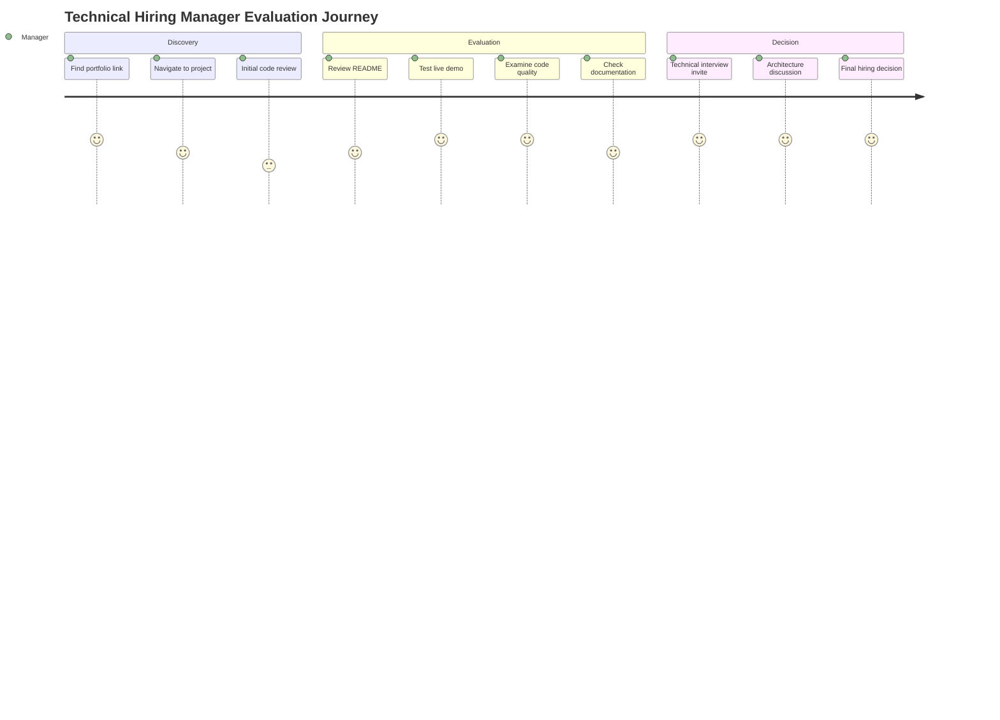
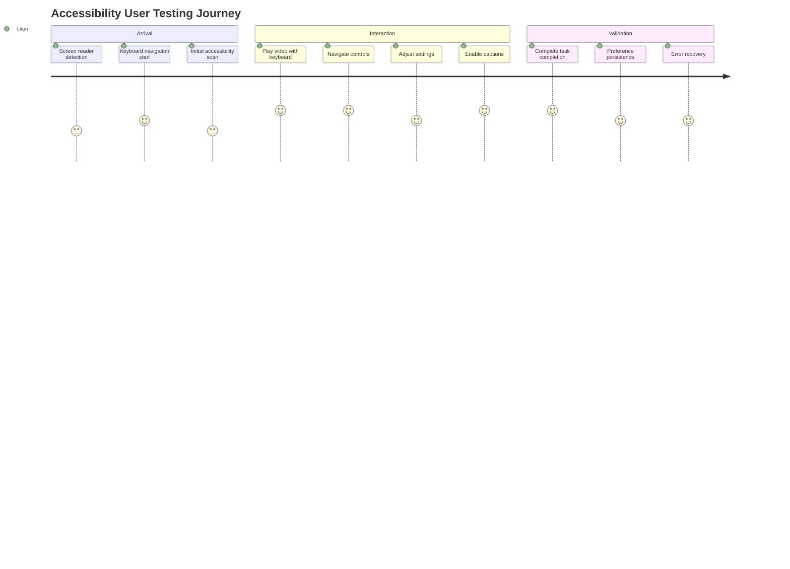

# 📋 Jordan (Product) - Product Requirements & Specifications

## **Product Vision & Strategy**

### **Product Mission Statement**
"Deliver a comprehensive video streaming demonstration that showcases enterprise-level product thinking, user-centered design, and technical execution while directly addressing FOX Corporation's streaming technology requirements and accessibility standards."

### **Product Objectives**
1. **Career Acceleration:** Secure FOX Corporation Senior Web/JavaScript Engineer position
2. **Technical Demonstration:** Prove streaming video and Smart TV platform expertise
3. **Industry Leadership:** Showcase modern accessibility and performance best practices
4. **Portfolio Enhancement:** Create flagship project for professional showcase

## **Market Research & Competitive Analysis**

### **Target Market Analysis**
```typescript
interface MarketAnalysis {
  primaryMarket: {
    segment: 'Enterprise streaming technology hiring managers'
    size: 'Major media companies (FOX, Disney, Netflix, YouTube, Hulu)'
    needs: ['Smart TV expertise', 'HLS streaming knowledge', 'React mastery', 'Accessibility compliance']
    painPoints: ['Finding candidates with TV platform experience', 'Modern React + streaming combination', 'Enterprise-quality code examples']
  }

  secondaryMarket: {
    segment: 'Web development community and potential employers'
    size: 'Tech companies building video-heavy applications'
    needs: ['Modern video player examples', 'Cross-platform development patterns', 'Accessibility implementation guides']
    painPoints: ['Limited open-source examples', 'Complex streaming integration', 'Multi-platform consistency']
  }
}
```

### **Competitive Landscape**
```typescript
interface CompetitiveAnalysis {
  directCompetitors: {
    'Video.js': {
      marketShare: 'High (industry standard)'
      strengths: ['Extensive ecosystem', 'Plugin architecture', 'Mature platform']
      weaknesses: ['jQuery dependency', 'Large bundle size', 'Complex API']
      differentiators: ['Modern React patterns', 'TypeScript first', 'Performance optimized']
    }

    'Plyr': {
      marketShare: 'Medium (modern alternative)'
      strengths: ['Clean design', 'Lightweight', 'Accessibility focus']
      weaknesses: ['Limited streaming features', 'Framework agnostic']
      differentiators: ['React native', 'Smart TV optimization', 'Enterprise patterns']
    }
  }

  indirectCompetitors: {
    'YouTube Player API': {
      limitations: 'Vendor lock-in, limited customization'
      differentiators: 'Full control, custom branding, HLS streaming'
    }

    'Native HTML5 Video': {
      limitations: 'No adaptive streaming, limited accessibility'
      differentiators: 'HLS support, comprehensive accessibility, Smart TV navigation'
    }
  }
}
```

## **User Research & Personas**

### **Primary User Personas**

#### **Persona 1: Technical Hiring Manager**
```typescript
interface TechnicalHiringManager {
  name: 'Sarah Chen'
  role: 'Senior Engineering Manager at FOX Corporation'
  goals: [
    'Find candidates with Smart TV development experience',
    'Evaluate React and TypeScript expertise',
    'Assess enterprise development practices',
    'Identify streaming video technology knowledge'
  ]
  painPoints: [
    'Most candidates lack TV platform experience',
    'Difficulty finding React + streaming combination',
    'Need evidence of enterprise-quality code',
    'Limited portfolio examples in streaming domain'
  ]
  evaluationCriteria: [
    'Code quality and architecture decisions',
    'Performance optimization for constrained devices',
    'Accessibility implementation depth',
    'Modern React patterns and best practices'
  ]
  successMetrics: [
    'Technical interview conversion rate',
    'Code review quality assessment',
    'Architectural discussion depth',
    'Problem-solving approach demonstration'
  ]
}
```

#### **Persona 2: Accessibility Advocate**
```typescript
interface AccessibilityAdvocate {
  name: 'Marcus Rodriguez'
  role: 'Digital Accessibility Consultant'
  disability: 'Blind, uses NVDA screen reader'
  goals: [
    'Evaluate WCAG 2.1 AA compliance',
    'Test screen reader compatibility',
    'Validate keyboard navigation patterns',
    'Assess caption and audio description support'
  ]
  painPoints: [
    'Most video players have poor accessibility',
    'Inconsistent keyboard navigation implementation',
    'Missing or incorrect ARIA labels',
    'Caption customization often inadequate'
  ]
  tools: ['NVDA screen reader', 'Keyboard-only navigation', 'Color contrast analyzers']
  successMetrics: [
    'Zero accessibility violations',
    'Complete keyboard operation',
    'Proper screen reader announcements',
    'Customizable caption preferences'
  ]
}
```

#### **Persona 3: Smart TV Developer**
```typescript
interface SmartTVDeveloper {
  name: 'Jennifer Kim'
  role: 'Connected TV Application Developer'
  platform: 'Roku, Samsung Tizen, LG webOS'
  goals: [
    'Learn modern web-based TV app patterns',
    'Understand performance optimization techniques',
    'Evaluate remote control navigation implementation',
    'Study cross-platform development approaches'
  ]
  painPoints: [
    'Limited TV-specific web development resources',
    'Performance constraints of TV hardware',
    'Complex remote control input handling',
    'Inconsistent platform capabilities'
  ]
  constraints: [
    'Memory limitations (< 150MB)',
    'CPU constraints (low-power ARM)',
    'Network variability',
    'Remote control input only'
  ]
  successMetrics: [
    'Smooth 30fps UI performance',
    'Sub-200ms input response time',
    'Logical spatial navigation',
    'Reliable video playback'
  ]
}
```

### **User Journey Mapping**

#### **Technical Hiring Manager Journey**


#### **Accessibility User Journey**


## **Product Requirements Specification**

### **Functional Requirements (Epic Level)**

#### **Epic 1: Core Video Playback**
```gherkin
Feature: HLS Video Streaming
  As a user viewing video content
  I want reliable adaptive streaming playback
  So that I can watch videos smoothly regardless of network conditions

  Background:
    Given I am on a video player demo page
    And the page has loaded completely
    And my network connection is stable

  Scenario: Automatic Quality Selection
    When the video starts playing
    Then the player should automatically select optimal quality
    And quality should adapt based on network bandwidth
    And I should see a quality indicator

  Scenario: Manual Quality Override
    Given the video is playing with automatic quality
    When I open the settings menu
    And I select a specific quality (1080p, 720p, 480p)
    Then the video should switch to the selected quality
    And the setting should persist for future videos

  Scenario: Error Recovery
    Given the video is playing normally
    When a network error occurs
    Then the player should attempt to recover automatically
    And I should see an appropriate error message if recovery fails
    And I should have an option to retry playback
```

#### **Epic 2: Smart TV Navigation**
```gherkin
Feature: Smart TV Remote Control
  As a Smart TV user with a remote control
  I want to navigate and control the video player using arrow keys
  So that I can enjoy content from my couch without additional devices

  Background:
    Given I am using a Smart TV or TV-connected device
    And I have a standard TV remote control
    And the video player is displayed on the TV

  Scenario: Basic Navigation
    When I press the Tab key or directional pad
    Then focus should move to the first interactive element
    And focused elements should be clearly highlighted
    And I should see navigation hints for available actions

  Scenario: Control Activation
    Given I have focused on a control element
    When I press Enter or OK on my remote
    Then the control should activate immediately
    And any state changes should be visually apparent
    And focus should remain on logical next element

  Scenario: Spatial Navigation
    Given I am focused on the play button
    When I press the right arrow key
    Then focus should move to the volume control
    When I press the down arrow key
    Then focus should move to the settings button
    And navigation should follow intuitive spatial layout
```

#### **Epic 3: Accessibility Excellence**
```gherkin
Feature: WCAG 2.1 AA Compliance
  As a user with disabilities
  I want to access all video player functionality
  So that I can enjoy content independently using assistive technology

  Background:
    Given I am using assistive technology (screen reader, keyboard only, etc.)
    And I have specific accessibility needs
    And the video player is fully loaded

  Scenario: Screen Reader Compatibility
    Given I am using a screen reader (NVDA, JAWS, VoiceOver)
    When I navigate the video player
    Then all controls should be properly labeled
    And state changes should be announced clearly
    And video content should be accessible via audio description

  Scenario: Keyboard-Only Operation
    Given I can only use keyboard input
    When I interact with the video player
    Then all functionality should be accessible via keyboard
    And tab order should be logical and complete
    And focus indicators should be clearly visible

  Scenario: Caption Customization
    Given I need customized captions for readability
    When I access caption settings
    Then I should be able to adjust font size, color, and position
    And settings should apply immediately to current video
    And preferences should persist across sessions
```

### **Non-Functional Requirements**

#### **Performance Requirements**
```typescript
interface PerformanceRequirements {
  loadTime: {
    initialPageLoad: '< 3 seconds on Smart TV hardware'
    videoStartTime: '< 1 second from play button click'
    seekingDelay: '< 500ms for seek operations'
    qualitySwitch: '< 2 seconds for manual quality changes'
  }

  resourceUsage: {
    memoryConsumption: '< 150MB on web browsers'
    mobileMemory: '< 200MB on mobile devices'
    cpuUsage: '< 30% on Smart TV hardware'
    networkBandwidth: 'Adaptive based on available bandwidth'
  }

  responsiveness: {
    userInteraction: '< 200ms response to user input'
    remoteControl: '< 200ms response to TV remote input'
    keyboardNavigation: '< 100ms focus change response'
    touchInteraction: '< 100ms touch response on mobile'
  }

  reliability: {
    videoPlayback: '99.5% successful playback rate'
    errorRecovery: '< 5 seconds automatic recovery time'
    networkResilience: 'Graceful degradation for poor connections'
    crossBrowser: '100% feature parity on supported browsers'
  }
}
```

#### **Compatibility Requirements**
```typescript
interface CompatibilityMatrix {
  browsers: {
    desktop: {
      chrome: { versions: ['90+'], support: 'full' }
      safari: { versions: ['14+'], support: 'full' }
      firefox: { versions: ['88+'], support: 'full' }
      edge: { versions: ['90+'], support: 'full' }
    }
    mobile: {
      mobileSafari: { versions: ['iOS 14+'], support: 'full' }
      mobileChrome: { versions: ['Android 8+'], support: 'full' }
    }
  }

  platforms: {
    smartTV: {
      roku: { versions: ['OS 10+'], features: ['remote', 'performance'] }
      tizen: { versions: ['6.0+'], features: ['dpad', 'voice'] }
      vizio: { versions: ['3.0+'], features: ['smartcast', 'chromecast'] }
    }
    mobile: {
      iOS: { versions: ['14+'], features: ['airplay', 'pip', 'background'] }
      android: { versions: ['API 26+'], features: ['chromecast', 'pip'] }
    }
  }

  accessibility: {
    screenReaders: ['NVDA', 'JAWS', 'VoiceOver', 'TalkBack']
    compliance: 'WCAG 2.1 AA (100% automated, manual validation)'
    colorContrast: '4.5:1 minimum for normal text, 3:1 for large text'
    keyboardSupport: '100% keyboard accessible functionality'
  }
}
```

## **Content Strategy & Test Data**

### **Video Content Sources**
```typescript
interface VideoContentStrategy {
  primary: {
    name: 'Planete Interdite HLS Stream'
    url: 'http://sample.vodobox.com/planete_interdite/planete_interdite_alternate.m3u8'
    features: ['Multiple quality levels', 'WebVTT captions', 'Adaptive bitrate']
    duration: '25:46'
    purpose: 'Primary HLS streaming demonstration'
    license: 'Public test content'
  }

  fallback: {
    name: 'Apple HLS Test Streams'
    url: 'https://devstreaming-cdn.apple.com/videos/streaming/examples/img_bipbop_adv_example_ts/master.m3u8'
    features: ['Apple HLS reference implementation', 'Multiple qualities']
    duration: '10:34'
    purpose: 'Cross-platform HLS validation'
    license: 'Apple test content'
  }

  local: {
    name: 'Big Buck Bunny MP4'
    url: 'https://commondatastorage.googleapis.com/gtv-videos-bucket/sample/BigBuckBunny.mp4'
    features: ['Standard MP4 format', 'No DRM', 'Creative Commons']
    duration: '9:56'
    purpose: 'Offline development and fallback testing'
    license: 'Creative Commons'
  }

  captions: {
    english: 'WebVTT format captions for accessibility testing'
    multilingual: 'Spanish, French subtitle options'
    audioDescription: 'Audio description track for blind users'
    customStyling: 'Caption appearance customization testing'
  }
}
```

### **Demo Page Structure**
```typescript
interface DemoPageArchitecture {
  homepage: {
    path: '/'
    purpose: 'Project introduction and navigation hub'
    features: ['Project overview', 'Technology stack', 'Demo links']
    cta: 'Explore different video player implementations'
  }

  hlsStreaming: {
    path: '/demo/hls-streaming'
    purpose: 'Demonstrate adaptive streaming capabilities'
    features: ['Quality selection', 'Adaptive bitrate', 'Network resilience']
    metrics: ['Quality switches', 'Buffering ratio', 'Start time']
  }

  smartTV: {
    path: '/demo/smart-tv'
    purpose: 'Showcase TV-optimized navigation and performance'
    features: ['D-pad navigation', 'Large UI elements', 'Performance monitoring']
    metrics: ['Input response time', 'Memory usage', 'Navigation efficiency']
  }

  accessibility: {
    path: '/demo/accessibility'
    purpose: 'Highlight WCAG compliance and inclusive design'
    features: ['Screen reader support', 'Keyboard navigation', 'Caption customization']
    metrics: ['Compliance score', 'Navigation efficiency', 'User satisfaction']
  }

  crossPlatform: {
    path: '/demo/cross-platform'
    purpose: 'Compare implementations across different platforms'
    features: ['Side-by-side comparison', 'Feature matrix', 'Performance comparison']
    metrics: ['Feature parity', 'Performance consistency', 'User experience quality']
  }
}
```

## **Success Metrics & KPIs**

### **Product Success Framework**
```typescript
interface ProductSuccessMetrics {
  userEngagement: {
    primary: {
      videoStartRate: {
        target: '> 80%',
        measurement: 'Percentage of visitors who start video playback',
        importance: 'Indicates demo effectiveness'
      }
      completionRate: {
        target: '> 60%',
        measurement: 'Percentage of users who watch demo to completion',
        importance: 'Shows content engagement'
      }
      interactionRate: {
        target: '> 70%',
        measurement: 'Percentage of users who interact with controls',
        importance: 'Demonstrates feature discovery'
      }
    }

    secondary: {
      timeOnPage: {
        target: '> 2 minutes',
        measurement: 'Average time spent on demo pages',
        importance: 'Indicates thorough evaluation'
      }
      returnVisits: {
        target: '> 20%',
        measurement: 'Users who return to explore more features',
        importance: 'Shows sustained interest'
      }
      shareRate: {
        target: '> 5%',
        measurement: 'Users who share demo with others',
        importance: 'Indicates recommendation value'
      }
    }
  }

  technicalPerformance: {
    reliability: {
      loadSuccessRate: {
        target: '> 99%',
        measurement: 'Percentage of successful page loads',
        importance: 'Basic functionality assurance'
      }
      videoPlaybackSuccess: {
        target: '> 95%',
        measurement: 'Percentage of successful video playback starts',
        importance: 'Core feature reliability'
      }
      errorRate: {
        target: '< 1%',
        measurement: 'Frequency of errors or failures',
        importance: 'User experience quality'
      }
    }

    performance: {
      lighthouseScore: {
        target: '> 95',
        measurement: 'Average Lighthouse performance score',
        importance: 'Technical excellence demonstration'
      }
      coreWebVitals: {
        target: 'All green',
        measurement: 'LCP < 2.5s, FID < 100ms, CLS < 0.1',
        importance: 'User experience optimization'
      }
      mobilePerformance: {
        target: '> 90',
        measurement: 'Mobile Lighthouse score',
        importance: 'Cross-platform consistency'
      }
    }
  }

  accessibilityCompliance: {
    automated: {
      wcagViolations: {
        target: '0',
        measurement: 'Automated accessibility test violations',
        importance: 'Compliance assurance'
      }
      contrastRatio: {
        target: '100% pass',
        measurement: 'Color contrast compliance rate',
        importance: 'Visual accessibility'
      }
      keyboardNavigation: {
        target: '100% accessible',
        measurement: 'All features accessible via keyboard',
        importance: 'Motor accessibility'
      }
    }

    manual: {
      screenReaderCompatibility: {
        target: '100% functional',
        measurement: 'All features work with screen readers',
        importance: 'Visual accessibility'
      }
      userTestingScore: {
        target: '> 4.5/5',
        measurement: 'Satisfaction score from disabled users',
        importance: 'Real-world usability'
      }
    }
  }

  careerImpact: {
    professional: {
      portfolioTraffic: {
        target: '+ 50%',
        measurement: 'Increase in jdilig.me traffic from demo',
        importance: 'Professional visibility'
      }
      githubEngagement: {
        target: '> 100 stars',
        measurement: 'Repository stars, forks, contributions',
        importance: 'Technical community recognition'
      }
      networkingOpportunities: {
        target: '> 10',
        measurement: 'New professional connections from project',
        importance: 'Career network expansion'
      }
    }

    hiring: {
      interviewConversions: {
        target: '> 3',
        measurement: 'Technical interviews resulting from demo',
        importance: 'Direct career impact'
      }
      jobOffers: {
        target: '≥ 1',
        measurement: 'Job offers attributed to project demonstration',
        importance: 'Ultimate success metric'
      }
      foxInterviewSuccess: {
        target: '100%',
        measurement: 'Successful FOX Corporation interview progression',
        importance: 'Primary project objective'
      }
    }
  }
}
```

---

**Product Strategy Summary:** This comprehensive product specification ensures we deliver a video player demonstration that not only works excellently across all platforms but tells a compelling story about product thinking, user research, technical execution, and professional capability. Every requirement directly supports the ultimate goal of securing the FOX Corporation position while showcasing industry-leading accessibility and performance standards.