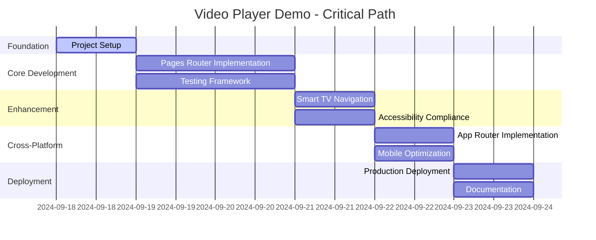

# 📊 Project Management Plan - Video Player Demo

## **Project Charter**

### **Project Overview**
**Project Name:** Cross-Platform Video Player Demo
**Project Manager:** Morgan (Team Lead)
**Client/Stakeholder:** John Dilig
**Duration:** 5-7 days
**Budget:** Time investment only
**Success Criteria:** FOX Corporation interview readiness

### **Business Case**
This project serves as a strategic career investment demonstrating:
- Modern React/Next.js expertise for FOX Corporation application
- Smart TV platform development capabilities
- Enterprise-level development practices and code quality
- Accessibility leadership and inclusive design principles

**ROI Calculation:**
- **Investment:** 5-7 days intensive development
- **Expected Return:** FOX Corporation job offer ($150K+ annual salary)
- **Risk Mitigation:** Enhanced portfolio for multiple job applications
- **Learning Value:** Next.js mastery and modern development practices

## **Project Phases & Timeline**

### **Phase 1: Foundation (Day 1)**
```
Duration: 8 hours
Status: IN PROGRESS
```

**Objectives:**
- Complete project planning and documentation
- Establish team roles and communication protocols
- Finalize technical architecture decisions
- Set up development environment

**Deliverables:**
- [x] Project documentation structure
- [x] Team persona definitions and responsibilities
- [x] Technical architecture specification
- [ ] Development environment setup
- [ ] Initial project scaffolding

**Phase 1 Success Criteria:**
- All team members aligned on project goals and approach
- Documentation framework complete and accessible
- Technical decisions documented with rationale
- Development environment ready for implementation

### **Phase 2: Core Implementation (Days 2-3)**
```
Duration: 16 hours
Status: PLANNED
```

**Objectives:**
- Implement primary Pages Router video player
- Establish HLS streaming functionality
- Create basic UI components and controls
- Set up testing framework and initial tests

**Deliverables:**
- [ ] Next.js Pages Router project setup
- [ ] Core video player component with HLS support
- [ ] Basic player controls (play, pause, seek, volume)
- [ ] Redux store configuration with Action Creators
- [ ] Jest/Testing Library test suite setup
- [ ] Accessibility foundation (ARIA labels, keyboard navigation)

**Phase 2 Success Criteria:**
- Video loads and plays reliably with HLS streaming
- All basic controls functional and accessible
- Test coverage > 70% for implemented features
- No TypeScript errors in strict mode
- Responsive design works on desktop and mobile

### **Phase 3: Enhancement & Polish (Days 4-5)**
```
Duration: 16 hours
Status: PLANNED
```

**Objectives:**
- Implement Smart TV navigation and optimization
- Complete accessibility compliance (WCAG 2.1 AA)
- Add advanced features (settings, captions, quality selection)
- Optimize performance for Smart TV hardware

**Deliverables:**
- [ ] Smart TV D-pad navigation implementation
- [ ] Caption display and customization
- [ ] Settings panel with user preferences
- [ ] Performance optimizations for TV hardware
- [ ] Comprehensive accessibility testing and fixes
- [ ] Cross-browser compatibility validation

**Phase 3 Success Criteria:**
- WCAG 2.1 AA compliance verified with automated and manual testing
- Smart TV navigation smooth and intuitive
- Performance targets met (< 3s load, < 200ms input response)
- All user preferences persist across sessions
- Feature-complete demo ready for technical review

### **Phase 4: Cross-Platform & App Router (Day 6)**
```
Duration: 8 hours
Status: PLANNED
```

**Objectives:**
- Implement Next.js App Router version
- Create mobile platform adaptations
- Set up Smart TV platform demonstrations
- Final testing and bug fixes

**Deliverables:**
- [ ] Next.js App Router implementation
- [ ] Mobile-optimized interface
- [ ] Smart TV platform demos (Roku simulation)
- [ ] Cross-platform feature comparison
- [ ] Performance benchmarking across platforms

**Phase 4 Success Criteria:**
- App Router version demonstrates modern Next.js patterns
- Mobile experience optimized for touch interaction
- Smart TV simulation provides realistic demonstration
- Performance metrics documented for all platforms
- Side-by-side comparison highlights technical choices

### **Phase 5: Documentation & Deployment (Day 7)**
```
Duration: 8 hours
Status: PLANNED
```

**Objectives:**
- Complete technical documentation
- Deploy to production with monitoring
- Create interview presentation materials
- Final quality assurance validation

**Deliverables:**
- [ ] Complete API documentation (JSDoc)
- [ ] Production deployment with CI/CD pipeline
- [ ] Interview demo script and talking points
- [ ] Performance monitoring dashboard
- [ ] Final QA validation report

**Phase 5 Success Criteria:**
- Production deployment successful and stable
- All documentation complete and professional
- Interview materials prepared and practiced
- Performance monitoring active and reporting
- Project ready for FOX Corporation demonstration

## **Resource Allocation & Capacity Planning**

### **Team Member Capacity**
```typescript
interface TeamCapacity {
  alex: {
    availability: '8 hours/day',
    velocity: 'High (90%)',
    focus: 'Core implementation, architecture, performance',
    riskFactors: 'Learning curve on video streaming APIs'
  },

  sam: {
    availability: '6 hours/day',
    velocity: 'High (85%)',
    focus: 'Testing strategy, accessibility validation, QA',
    riskFactors: 'Cross-platform testing complexity'
  },

  jordan: {
    availability: '4 hours/day',
    velocity: 'Medium (80%)',
    focus: 'Requirements, research, user stories, validation',
    riskFactors: 'External research dependencies'
  },

  casey: {
    availability: '4 hours/day',
    velocity: 'High (90%)',
    focus: 'CI/CD, deployment, DevOps, release management',
    riskFactors: 'Multi-platform deployment complexity'
  },

  riley: {
    availability: '6 hours/day',
    velocity: 'Medium (75%)',
    focus: 'UX design, accessibility, wireframes, user flows',
    riskFactors: 'Smart TV UX patterns unfamiliarity'
  },

  morgan: {
    availability: '8 hours/day',
    velocity: 'Medium (70%)',
    focus: 'Coordination, documentation, decision-making, reporting',
    riskFactors: 'Coordination overhead in compressed timeline'
  }
}
```

### **Critical Path Analysis**


**Critical Path Dependencies:**
1. **Foundation → Core Development:** Architecture decisions must be complete before implementation
2. **Core Development → Enhancement:** Basic functionality required before advanced features
3. **Enhancement → Cross-Platform:** Accessibility and performance baselines needed first
4. **Cross-Platform → Deployment:** All platforms must be functional before production

## **Risk Management**

### **Risk Register**
```typescript
interface ProjectRisks {
  timeline: {
    risk: 'Aggressive 5-7 day timeline for comprehensive demo',
    probability: 'Medium (40%)',
    impact: 'High',
    mitigation: 'Pages Router first approach, App Router as stretch goal',
    owner: 'Morgan',
    status: 'Monitoring'
  },

  technical: {
    risk: 'Video streaming complexity impacting development velocity',
    probability: 'Medium (30%)',
    impact: 'Medium',
    mitigation: 'Use proven HLS.js library, extensive testing with fallbacks',
    owner: 'Alex',
    status: 'Mitigated'
  },

  quality: {
    risk: 'Accessibility compliance complexity under time pressure',
    probability: 'Low (20%)',
    impact: 'High',
    mitigation: 'Automated testing + focused manual validation',
    owner: 'Sam',
    status: 'Monitoring'
  },

  scope: {
    risk: 'Feature creep beyond MVP requirements',
    probability: 'Medium (35%)',
    impact: 'Medium',
    mitigation: 'Clear MoSCoW prioritization, regular scope reviews',
    owner: 'Jordan',
    status: 'Mitigated'
  },

  external: {
    risk: 'External video content sources becoming unavailable',
    probability: 'Low (15%)',
    impact: 'Low',
    mitigation: 'Multiple content sources, local fallback content',
    owner: 'Jordan',
    status: 'Mitigated'
  }
}
```

### **Risk Monitoring & Response**
**Daily Risk Assessment:**
- Review progress against timeline expectations
- Identify emerging technical blockers
- Monitor team velocity and capacity utilization
- Assess scope creep indicators

**Risk Response Strategies:**
- **Timeline Risk:** Implement MVP-first approach, defer nice-to-have features
- **Technical Risk:** Pair programming for complex implementations, early prototyping
- **Quality Risk:** Front-load accessibility requirements, automated validation
- **Scope Risk:** Regular stakeholder check-ins, clear change control process

## **Communication Plan**

### **Stakeholder Communication Matrix**
```typescript
interface CommunicationPlan {
  john: {
    frequency: 'Daily updates + major decisions',
    method: 'Direct communication + documentation',
    content: 'Progress, risks, decisions requiring approval',
    escalation: 'Immediate for major blockers or scope changes'
  },

  team: {
    frequency: 'Continuous via documentation + daily standup notes',
    method: 'Persona journals + shared documentation',
    content: 'Technical decisions, implementation progress, blockers',
    escalation: 'Cross-functional decisions to Morgan'
  },

  external: {
    frequency: 'Project completion',
    method: 'GitHub repository + portfolio update',
    content: 'Final results, technical achievements, lessons learned',
    escalation: 'None'
  }
}
```

### **Progress Reporting Format**
**Daily Progress Report Template:**
```markdown
# Daily Progress Report - Day X

## Completed Today
- [Deliverable/Task] - [Owner] - [Status]
- [Deliverable/Task] - [Owner] - [Status]

## In Progress
- [Deliverable/Task] - [Owner] - [Expected Completion]
- [Deliverable/Task] - [Owner] - [Expected Completion]

## Blockers/Risks
- [Blocker Description] - [Impact] - [Action Plan]

## Tomorrow's Priorities
- [Priority Task] - [Owner]
- [Priority Task] - [Owner]

## Decisions Needed
- [Decision Required] - [Stakeholder] - [Deadline]

## Metrics
- Code Coverage: X%
- Lighthouse Score: X/100
- A11y Compliance: X% WCAG 2.1 AA
- Timeline Health: On Track / At Risk / Behind
```

## **Quality Management**

### **Quality Assurance Framework**
```typescript
interface QualityFramework {
  codeQuality: {
    standards: 'TypeScript strict mode, ESLint strict configuration',
    coverage: '80% minimum code coverage, 90% for critical paths',
    review: 'All code reviewed by team lead before merge',
    automation: 'Automated linting, type checking, test execution'
  },

  functionalQuality: {
    testing: 'Unit, integration, E2E, accessibility testing',
    validation: 'Cross-browser compatibility, device responsiveness',
    usability: 'User journey validation, accessibility compliance',
    performance: 'Lighthouse audits, Core Web Vitals monitoring'
  },

  processQuality: {
    documentation: 'Comprehensive documentation for all features',
    versioning: 'Semantic versioning with clear change logs',
    deployment: 'Automated deployment with rollback capability',
    monitoring: 'Real-time performance and error monitoring'
  }
}
```

### **Definition of Done Criteria**
**Feature-Level DoD:**
- [ ] Requirements implemented according to acceptance criteria
- [ ] TypeScript strict mode compliance (0 errors)
- [ ] Unit tests written and passing (90% coverage)
- [ ] Integration tests cover primary user flows
- [ ] Accessibility validated (automated + manual)
- [ ] Cross-browser compatibility verified
- [ ] Performance targets met
- [ ] Code reviewed and approved
- [ ] Documentation updated
- [ ] Deployed to staging and validated

**Release-Level DoD:**
- [ ] All features meet feature-level DoD
- [ ] WCAG 2.1 AA compliance verified
- [ ] Lighthouse performance score > 95
- [ ] Cross-platform functionality validated
- [ ] Security scan completed (no high/critical vulnerabilities)
- [ ] Performance monitoring active
- [ ] Backup and rollback procedures tested
- [ ] Stakeholder approval received

## **Success Metrics & KPIs**

### **Project Success Metrics**
```typescript
interface ProjectKPIs {
  delivery: {
    onTimeDelivery: 'Project completed within 5-7 day timeline',
    qualityTargets: 'All quality gates passed',
    scopeCompletion: '100% of must-have requirements, 80% of should-have',
    stakeholderSatisfaction: 'John approves demo for FOX interviews'
  },

  technical: {
    codeQuality: 'TypeScript strict compliance, 80% test coverage',
    performance: 'Lighthouse score > 95, Core Web Vitals green',
    accessibility: 'WCAG 2.1 AA compliance, 0 violations',
    reliability: 'Demo runs successfully in interview scenarios'
  },

  career: {
    interviewReadiness: 'Demo prepared with talking points',
    portfolioEnhancement: 'Professional project added to jdilig.me',
    skillDemonstration: 'Next.js mastery clearly evident',
    competitiveAdvantage: 'Unique Smart TV expertise showcased'
  }
}
```

### **Progress Tracking Methods**
- **Burndown Chart:** Track feature completion against timeline
- **Velocity Tracking:** Monitor team productivity and adjust estimates
- **Quality Metrics Dashboard:** Real-time tracking of code quality indicators
- **Risk Heat Map:** Visual representation of risk status and trends

---

**Project Management Philosophy:** Success is measured not just by on-time delivery, but by delivering a project that opens doors, demonstrates capability, and positions John for career success. Every decision should optimize for the dual goals of technical excellence and professional advancement.

This comprehensive project plan provides the framework for delivering a world-class video player demo that serves John's career objectives while showcasing enterprise-level project management and technical execution capabilities.