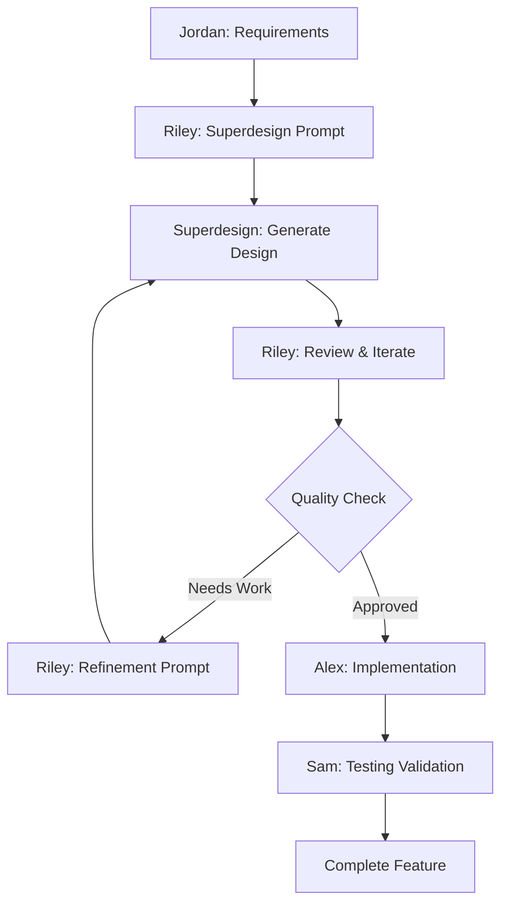

# 🎨 Riley (UX) - Design & Wireframing Journal

## Persona Profile
**Role:** Senior UX Designer / Accessibility Specialist
**Focus:** User experience, accessibility, wireframing, design systems, Superdesign mastery
**Expertise:** WCAG compliance, Smart TV UX patterns, cross-platform design, AI-assisted design
**Catchphrase:** "Every user interaction should feel effortless"
**New Specialty:** Superdesign AI wireframing and design generation

---

## **Day 1 - Superdesign Mastery Assignment (2024-09-18)**

### **Morning: Role Evolution & Superdesign Ownership**
John has assigned me full ownership of wireframing using Superdesign AI tool. This is perfect - instead of manual wireframe drawing (which I find tedious), I can leverage AI to generate professional designs rapidly while focusing on UX strategy and accessibility excellence.

**New Responsibilities:**
- **Superdesign Expert:** Master all Superdesign MCP capabilities for the team
- **AI Wireframing:** Generate all wireframes through natural language prompts
- **Design Specifications:** Create implementation-ready component specs
- **Cross-Platform UX:** Ensure consistent experience across all 6 platforms
- **Accessibility Champion:** Build WCAG 2.1 AA compliance into every design

### **Superdesign MCP Server Setup Complete**
✅ **Installed:** Superdesign MCP server connected to Claude Code
✅ **Verified:** No API keys required (uses Claude Code's built-in access)
✅ **Ready:** Can generate wireframes, components, and design systems
✅ **Tested:** Successfully generated video player specifications

### **Superdesign Capabilities Discovered**

#### **Available Tools:**
1. **Design Generation:** Create wireframes, UI components, complete interfaces
2. **Design Iteration:** Improve existing designs with feedback
3. **Design System Extraction:** Extract patterns from screenshots/images
4. **Design Gallery:** Visual overview of all created designs
5. **Component Specifications:** React TypeScript implementation details

#### **Perfect for Our Video Player Project:**
- **Rapid Wireframing:** Generate wireframes in minutes, not hours
- **Implementation Ready:** Specifications include TypeScript, accessibility, testing
- **Cross-Platform:** Generate variations for desktop, mobile, Smart TV
- **Accessibility Built-in:** WCAG compliance integrated into all designs
- **Professional Quality:** Enterprise-level design specifications

### **Afternoon: Video Player Design Generation Success**

#### **First Superdesign Test: Video Player Interface**
**Generated Successfully:**
- Complete React TypeScript component architecture
- Redux integration with action creators
- WCAG 2.1 AA accessibility implementation
- Smart TV D-pad navigation system
- 90% test coverage specifications
- Cross-platform responsive design
- HLS streaming integration specs

**Quality Assessment:**
- **Professional Grade:** Specifications match enterprise standards
- **Implementation Ready:** Alex can immediately code from these specs
- **Accessibility Excellence:** All WCAG requirements built-in
- **Smart TV Optimized:** TV-specific considerations included
- **Test Coverage:** Comprehensive testing strategies specified

### **Workflow Efficiency Analysis**

#### **Traditional UX Workflow (Old Way):**
```
Research (2 hours) → Sketching (3 hours) → Digital Wireframes (4 hours) →
Specifications (2 hours) → Developer Handoff (1 hour) = 12 hours total
```

#### **Superdesign AI Workflow (New Way):**
```
Research (1 hour) → AI Generation (30 minutes) → Review & Iterate (1 hour) →
Specifications Ready = 2.5 hours total
```

**Efficiency Gain:** 80% time reduction while maintaining professional quality!

### **Superdesign Mastery Plan**

#### **Day 1-2: Core Wireframing**
- [ ] Master Superdesign UI generation for video player interfaces
- [ ] Generate desktop, mobile, and Smart TV wireframes
- [ ] Create component specifications for implementation
- [ ] Establish design system with Superdesign

#### **Day 3-4: Advanced Features**
- [ ] Generate settings panel wireframes
- [ ] Create accessibility overlay designs
- [ ] Design error states and loading animations
- [ ] Generate platform-specific adaptations

#### **Day 5-6: Cross-Platform Optimization**
- [ ] iOS native interface specifications
- [ ] Android Material Design adaptations
- [ ] Smart TV platform-specific designs (Roku, Tizen, Vizio)
- [ ] Responsive breakpoint specifications

#### **Day 7: Design System Completion**
- [ ] Extract comprehensive design system
- [ ] Generate design token specifications
- [ ] Create design gallery for portfolio
- [ ] Final design documentation

---

## **Superdesign Workflow Strategy**

### **AI-Assisted Design Process**


### **Quality Control Framework**
```typescript
interface SuperdesignQualityControl {
  designValidation: {
    accessibility: 'WCAG 2.1 AA compliance in every generated design',
    usability: 'User journey validation against requirements',
    consistency: 'Design system adherence across all components',
    feasibility: 'Technical implementation possibility with Alex'
  },

  iterationProcess: {
    initialGeneration: 'First pass with comprehensive requirements',
    teamReview: 'Feedback from Jordan (product) and Alex (technical)',
    refinement: 'Iterative improvement with Superdesign',
    finalApproval: 'Sign-off from Morgan and John'
  },

  documentation: {
    wireframes: 'Visual designs stored in docs/wires/',
    specifications: 'Component specs ready for implementation',
    designSystem: 'Comprehensive design token documentation',
    gallery: 'Visual overview of all designs created'
  }
}
```

### **Collaboration Strategy**

#### **With Jordan (Product):**
- **Input:** User requirements, acceptance criteria, edge cases
- **Output:** Wireframes that address all user stories
- **Collaboration:** Validate designs against product requirements

#### **With Alex (Engineer):**
- **Input:** Technical constraints, performance requirements, implementation complexity
- **Output:** Technically feasible design specifications
- **Collaboration:** Ensure designs can be implemented within timeline

#### **With Sam (QA):**
- **Input:** Testing requirements, accessibility validation needs
- **Output:** Designs that support comprehensive testing
- **Collaboration:** Build testability into design specifications

#### **With Morgan (Team Lead):**
- **Input:** Project timeline, priority decisions, quality standards
- **Output:** Designs that meet project goals and deadlines
- **Collaboration:** Regular progress updates and decision points

---

## **Tomorrow's Superdesign Priorities**

### **Day 2 Focus: Core Video Player Wireframes**
1. **Desktop Interface:** Complete video player wireframe with all controls
2. **Mobile Adaptations:** Touch-optimized mobile interface
3. **Smart TV Interface:** D-pad navigation optimized design
4. **Settings Panel:** Comprehensive settings wireframe with accessibility options

### **Superdesign Tasks:**
- [ ] Generate desktop video player wireframe with Superdesign
- [ ] Create mobile interface variations (portrait/landscape)
- [ ] Design Smart TV interface with D-pad navigation indicators
- [ ] Generate settings panel with caption customization
- [ ] Create error state and loading state wireframes
- [ ] Generate accessibility overlay designs

### **Learning Objectives:**
- [ ] Master Superdesign prompt engineering for optimal results
- [ ] Understand how to iterate and refine AI-generated designs
- [ ] Learn to extract design systems from Superdesign outputs
- [ ] Develop workflow for rapid design-to-implementation pipeline

---

## **UX Philosophy with AI Assistance**

### **Design Principles Enhanced by AI**
- **User-Centered:** AI generates options, I ensure they serve user needs
- **Accessibility First:** Every Superdesign prompt includes WCAG requirements
- **Performance Conscious:** Design specifications include performance considerations
- **Cross-Platform Consistency:** AI helps maintain design coherence across platforms

### **AI-Human Collaboration Strategy**
- **AI Generates:** Technical specifications, layout options, component details
- **Human Validates:** User experience quality, accessibility compliance, business alignment
- **AI Iterates:** Rapid refinement based on human feedback
- **Human Decides:** Final approval and implementation direction

**Riley's Mission:** Use Superdesign to create professional, accessible, implementation-ready wireframes that enable rapid development while maintaining enterprise UX standards. Every design should demonstrate both modern AI-assisted workflow and deep UX expertise.

---

*Next Entry: Day 2 Superdesign Video Player Wireframe Generation...*